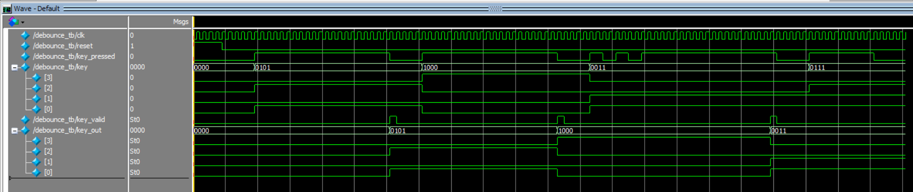
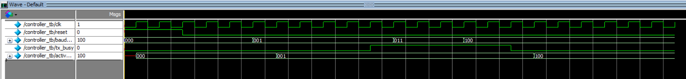
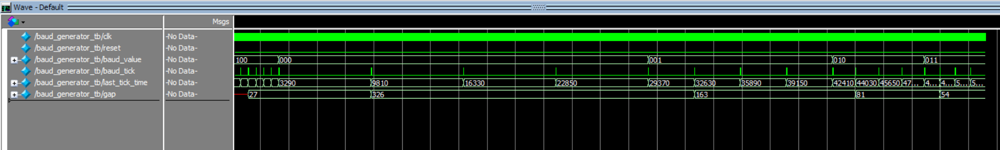
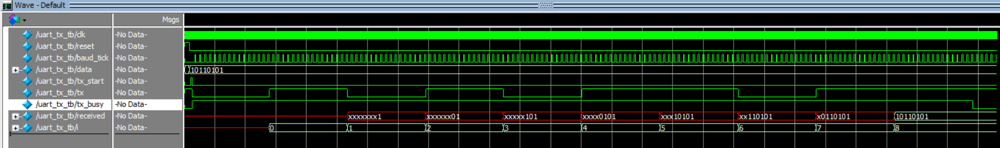

# UART with Runtime-Configurable Baud Rate

**Verilog HDL | Intel Cyclone IV FPGA | ModelSim Verification**

A configurable UART subsystem implemented in **Verilog HDL** that allows the baud rate to be changed at runtime using a **4×4 matrix keypad**, eliminating the need to recompile or reconfigure the FPGA.

---

# Project Highlights

- Designed **8 modular RTL modules** in Verilog HDL
- Implemented runtime-selectable UART baud rates through a **4×4 matrix keypad**
- Developed independent **ModelSim testbenches** for every RTL module
- Implemented a **16× oversampled UART receiver** for reliable asynchronous communication
- Integrated keypad input, baud-rate parsing, clock generation, and UART communication into a complete subsystem
- Successfully synthesized, placed-and-routed, and timing-verified on an **Intel Cyclone IV FPGA**

---

# Overview

This project implements a configurable UART transmitter and receiver entirely in Verilog HDL. Unlike conventional UART implementations with a fixed baud rate, this design allows users to select a supported baud rate at runtime using a 4×4 matrix keypad.

The keypad input is scanned, debounced, validated, and converted into the corresponding baud-rate selection. A dedicated controller safely applies baud-rate changes only when the UART transmitter is idle, preventing corruption of ongoing transmissions.

The receiver employs **16× oversampling** with start-bit confirmation for robust asynchronous communication, while the transmitter echoes received bytes to demonstrate end-to-end UART functionality.

---

# Features

## Runtime Configuration

- 4×4 matrix keypad interface
- Debounced keypad input
- Runtime baud-rate selection
- Baud-rate validation
- Safe baud-rate switching while UART is idle

## UART Communication

- UART transmitter
- UART receiver
- 16× oversampling receiver
- Start-bit confirmation
- Frame error detection
- UART loopback demonstration

## FPGA Design

- Modular RTL architecture
- Hierarchical design
- Parameterized modules
- Functional verification using ModelSim

---

# Supported Baud Rates

| Baud Rate | Divider (50MHz sys clk, 16x oversample) | Measured error |
|----------:|:----------------------------------------:|:---------------:|
| 9600      | 326 | ~0.15% |
| 19200     | 163 | ~0.15% |
| 38400     | 81  | ~0.47% |
| 57600     | 54  | ~0.46% |
| 115200    | 27  | ~0.47% |

---

# System Architecture

```text
                              uart_top
                                 |
      +-------------+------------+------------+-------------+---------+
      |             |            |            |             |         |
      v             v            v            v             v         v
keypad_scanner  baud_parser  controller  baud_generator  uart_rx   uart_tx
      |
      v
  debounce
```

---

# RTL Module Hierarchy

```text
uart_top
│
├── keypad_scanner
│   └── debounce
│
├── baud_parser
├── controller
├── baud_generator
├── uart_tx
└── uart_rx
```

---

# RTL Modules

| Module | Description |
|---|---|
| `debounce` | Debounces a raw key-press signal, producing a single clean pulse per press |
| `keypad_scanner` | Scans the 4x4 matrix keypad using synchronized, settle-timed column scanning; maps detected presses to key values via a lookup table |
| `baud_parser` | Accumulates typed digits, supports backspace, and validates the entered sequence against the five supported baud rates on Enter |
| `controller` | Gates baud rate changes so a new rate only takes effect once any in-progress transmission completes (deferred commit, last-one-wins) |
| `baud_generator` | Generates 16x-oversampled baud timing ticks from a runtime-selected divider |
| `uart_tx` | UART transmitter: 8N1 framing, LSB-first |
| `uart_rx` | UART receiver: 16x oversampled bit-center sampling, start-bit glitch rejection, framing-error detection |
| `uart_top` | Top-level integration, including loopback wiring |

---

# Verification

The design follows a module-by-module verification methodology.

Each RTL module includes an independent ModelSim testbench verifying normal operation, edge cases, and targeted failure conditions.

For the UART datapath, the testbenches also support randomized stimulus. In addition to directed test vectors for important patterns and boundary conditions, randomized 8-bit data values can exercise a wider range of UART TX/RX behavior.

ModelSim transcripts use standardized `PASS` / `FAIL` messages. A Python verification script parses one or more ModelSim log files and generates JSON, CSV, and HTML reports, including pass/fail counts, success rate, and failed test names.

| RTL Module | Testbench | Status |
|------------|-----------|--------|
| debounce | debounce_tb | ✅ |
| keypad_scanner | keypad_scanner_tb | ✅ |
| baud_parser | baud_parser_tb | ✅ |
| controller | controller_tb | ✅ |
| baud_generator | baud_generator_tb | ✅ |
| uart_tx | uart_tx_tb | ✅ |
| uart_rx | uart_rx_tb | ✅ |
| uart_top | uart_top_tb | ✅ |

Representative verification waveforms are available in the **waveforms/** directory.

| Module | Waveform |
|---------|----------|
| Debounce |  |
| Keypad Scanner |  |
| Baud Parser |  |
| Controller |  |
| Baud Generator |  |
| UART TX |  |
| UART RX |  |
| UART Top |  |

---

# FPGA Implementation Summary

The design was successfully synthesized, placed-and-routed, and timing-verified using Intel Quartus Prime Lite.

| Item | Result |
|------|--------|
| Target Device | Intel Cyclone IV E (EP4CE6E22C8) |
| Compilation | ✅ Successful |
| Static Timing Analysis | ✅ Successful |
| Target Clock | 50 MHz |
| Maximum Operating Frequency (Fmax) | **99.2 MHz** |
| Worst-Case Slack | **+9.919 ns** |
| Logic Elements | **310 / 6,272 (5%)** |
| Registers | **157** |
| I/O Pins | **14 / 92 (15%)** |

---

# Project Structure

```text
UART/
│
├── rtl/                         # Verilog HDL source files
│
├── tb/                          # ModelSim testbenches
│
├── scripts/                     # Python verification/reporting scripts
│
├── verification/
│   ├── logs/                    # ModelSim simulation logs
│   ├── reports/                 # Generated JSON, CSV, and HTML reports
│   └── waveforms/               # Verification waveform screenshots
│
├── docs/                        # Project documentation
│
├── UART.sdc                     # Timing constraints
├── LICENSE
└── README.md
```

---

# Development Tools

- Verilog HDL
- Intel Quartus Prime Lite
- ModelSim
- Git & GitHub

---

# Results

The UART subsystem was successfully:

- Simulated and verified using ModelSim
- Tested with dedicated module-level testbenches
- Integrated and validated at the top level
- Synthesized and timing-verified using Intel Quartus Prime
- Implemented on an Intel Cyclone IV FPGA

---

## Bugs Found and Fixed

Each of these was found through careful waveform or transcript tracing during verification, not caught by inspection alone. Documenting them here because the process of finding them is as representative of the engineering work as the final code.

- **`debounce`** — an early version let its internal counter keep incrementing after the debounce threshold was reached, since the guard only checked part of the condition. Fixed by gating the entire counting branch on whether debounce had already completed.

- **`keypad_scanner` — same-cycle write race** — `key_held` was written in two places within one always-block: once when a key was detected, once at the column-scan wrap. When the pressed key was on the last-scanned column, both writes landed in the same clock cycle, and the wrap's write silently overwrote the detection — permanently dropping every press on that one column. Found by testing each column individually rather than assuming symmetry across columns, and confirmed fixed by re-running the same waveform test.

- **`keypad_scanner` — row polarity** — an early row-detection implementation assumed active-high row reads; the actual keypad wiring is active-low (a pressed key pulls its row line to 0, not 1). Traced through the physical pull-up/switch circuit to confirm the correct polarity before fixing the priority-encoding logic.

- **Timing counters — off-by-one thresholds** — several counters (the keypad settle counter, the baud tick counter) initially compared against the raw threshold instead of `threshold - 1`, adding one extra clock cycle to every timing period. Fixed by tracing each counter's value cycle-by-cycle against the intended fire point, and re-verified against analytically calculated divider values in a self-checking testbench.

- **`uart_rx` — stuck-state risk** — the original STOP-state logic only transitioned back to `IDLE` when the stop bit was valid, meaning a framing error (missing stop bit) would leave the receiver permanently stuck, unable to receive anything else without an external reset. Fixed by making the state transition unconditional on the 16-tick timeout, with the stop-bit check only deciding whether to report a valid byte or a `frame_error` — never whether to advance the state machine. Verified by deliberately sending a malformed frame and confirming the receiver correctly recovered and decoded the next, valid frame immediately after.

- **Top-level integration — static array bounds** — Quartus's static elaboration flagged an out-of-range array access in `baud_parser`'s digit-clearing loop that ModelSim did not catch, because the loop bound depended on a runtime variable (`digit_count`) that Quartus could not statically prove stayed within range, even though the surrounding logic guaranteed it at runtime. Fixed by making the loop bound a literal constant matching the array's declared size, with the runtime check moved inside the loop body — a fix driven by understanding *why* two different tools disagreed on the same code, not just satisfying the error message.

---

# Skills Demonstrated

- Verilog HDL
- RTL Design
- Finite State Machine (FSM) Design
- UART Protocol Implementation
- 16× Oversampling
- Clock Division
- Digital Debouncing
- Clock Domain Synchronization
- Modular FPGA Design
- Functional Verification
- Self-Checking Testbenches
- Randomized Verification
- ModelSim Simulation
- Python Verification Automation
- Test Log Parsing
- JSON / CSV / HTML Reporting
- Intel Quartus Prime
- Static Timing Analysis (STA)

---

# Project Status

✅ Complete

This project demonstrates the complete FPGA development workflow, from RTL design and functional verification to synthesis, timing closure, and FPGA implementation. It showcases a modular, runtime-configurable UART subsystem with robust receiver design and comprehensive verification.

---

# License

This project is intended for educational, research, and portfolio purposes.
