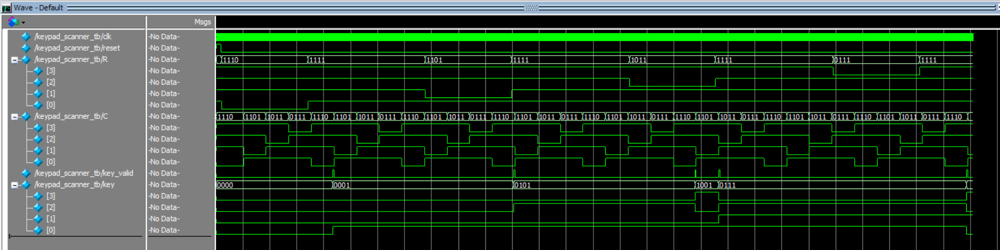
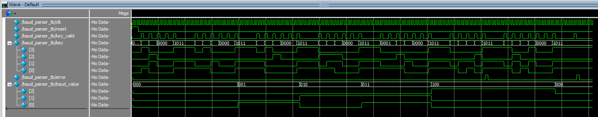
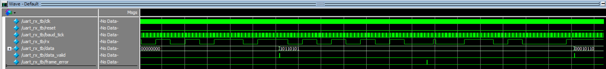
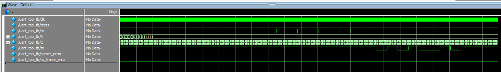

# UART with Runtime-Configurable Baud Rate

**Verilog HDL | Intel Cyclone IV FPGA | ModelSim Verification**

A configurable UART subsystem implemented in **Verilog HDL** that allows the baud rate to be changed at runtime using a **4×4 matrix keypad**, eliminating the need to recompile or reconfigure the FPGA.

---

# Project Highlights

- Designed **8 modular RTL modules** in Verilog HDL
- Implemented runtime-selectable UART baud rates through a **4×4 matrix keypad**
- Developed independent **ModelSim testbenches** for every RTL module
- Implemented a **16× oversampled UART receiver** for reliable asynchronous communication
- Integrated keypad input, baud-rate parsing, clock generation, and UART communication into a complete subsystem
- Successfully synthesized, placed-and-routed, and timing-verified on an **Intel Cyclone IV FPGA**

---

# Overview

This project implements a configurable UART transmitter and receiver entirely in Verilog HDL. Unlike conventional UART implementations with a fixed baud rate, this design allows users to select a supported baud rate at runtime using a 4×4 matrix keypad.

The keypad input is scanned, debounced, validated, and converted into the corresponding baud-rate selection. A dedicated controller safely applies baud-rate changes only when the UART transmitter is idle, preventing corruption of ongoing transmissions.

The receiver employs **16× oversampling** with start-bit confirmation for robust asynchronous communication, while the transmitter echoes received bytes to demonstrate end-to-end UART functionality.

---

# Features

## Runtime Configuration

- 4×4 matrix keypad interface
- Debounced keypad input
- Runtime baud-rate selection
- Baud-rate validation
- Safe baud-rate switching while UART is idle

## UART Communication

- UART transmitter
- UART receiver
- 16× oversampling receiver
- Start-bit confirmation
- Frame error detection
- UART loopback demonstration

## FPGA Design

- Modular RTL architecture
- Hierarchical design
- Parameterized modules
- Functional verification using ModelSim

---

# Supported Baud Rates

| Baud Rate |
|-----------:|
| 9600 |
| 19200 |
| 38400 |
| 57600 |
| 115200 |

---

# System Architecture

```text
                   uart_top
                              |
      +------------+----------+----------+------------+------------+
      |            |          |          |            |            |
      v            v          v          v            v            v
 keypad_scanner  baud_parser  controller  baud_generator  uart_rx   uart_tx
      |
      v
  debounce
```

---

# RTL Module Hierarchy

```text
uart_top
│
├── keypad_scanner
│   └── debounce
│
├── baud_parser
├── controller
├── baud_generator
├── uart_tx
└── uart_rx
```

---

# RTL Modules

| Module | Description |
|---------|-------------|
| `keypad_scanner` | Scans the 4×4 keypad and decodes key presses |
| `debounce` | Removes switch bounce and generates a single valid key pulse |
| `baud_parser` | Validates keypad input and converts it into a supported baud-rate selection |
| `controller` | Defers baud-rate updates until the transmitter is idle |
| `baud_generator` | Generates 16× oversampling baud ticks |
| `uart_tx` | UART transmitter finite-state machine |
| `uart_rx` | UART receiver with 16× oversampling and frame-error detection |
| `uart_top` | Top-level integration module |

---

# Verification

The design follows a module-by-module verification methodology.

Each RTL module includes an independent ModelSim testbench verifying both normal operation and edge cases.

| RTL Module | Testbench | Status |
|------------|-----------|--------|
| debounce | debounce_tb | ✅ |
| keypad_scanner | keypad_scanner_tb | ✅ |
| baud_parser | baud_parser_tb | ✅ |
| controller | controller_tb | ✅ |
| baud_generator | baud_generator_tb | ✅ |
| uart_tx | uart_tx_tb | ✅ |
| uart_rx | uart_rx_tb | ✅ |
| uart_top | uart_top_tb | ✅ |

Representative verification waveforms are available in the **waveforms/** directory.

| Module | Waveform |
|---------|----------|
| Debounce |  |
| Keypad Scanner |  |
| Baud Parser |  |
| Controller |  |
| Baud Generator |  |
| UART TX |  |
| UART RX |  |
| UART Top |  |

---

# FPGA Implementation Summary

The design was successfully synthesized, placed-and-routed, and timing-verified using Intel Quartus Prime Lite.

| Item | Result |
|------|--------|
| Target Device | Intel Cyclone IV E (EP4CE6E22C8) |
| Compilation | ✅ Successful |
| Static Timing Analysis | ✅ Successful |
| Target Clock | 50 MHz |
| Maximum Operating Frequency (Fmax) | **99.2 MHz** |
| Worst-Case Slack | **+9.919 ns** |
| Logic Elements | **310 / 6,272 (5%)** |
| Registers | **157** |
| I/O Pins | **14 / 92 (15%)** |

---

# Project Structure

```text
UART/
│
├── rtl/                 # Verilog HDL source files
├── tb/                  # ModelSim testbenches
├── waveforms/           # Verification waveform screenshots
├── docs/                # Documentation
├── UART.sdc             # Timing constraints
├── LICENSE
└── README.md
```

---

# Development Tools

- Verilog HDL
- Intel Quartus Prime Lite
- ModelSim
- Git & GitHub

---

# Results

The UART subsystem was successfully:

- Simulated and verified using ModelSim
- Tested with dedicated module-level testbenches
- Integrated and validated at the top level
- Synthesized and timing-verified using Intel Quartus Prime
- Implemented on an Intel Cyclone IV FPGA

---

# Skills Demonstrated

- Verilog HDL
- RTL Design
- Finite State Machine (FSM) Design
- UART Protocol Implementation
- 16× Oversampling
- Clock Division
- Digital Debouncing
- Clock Domain Synchronization
- Modular FPGA Design
- Functional Verification
- ModelSim Simulation
- Intel Quartus Prime
- Static Timing Analysis (STA)

---

# Project Status

✅ Complete

This project demonstrates the complete FPGA development workflow, from RTL design and functional verification to synthesis, timing closure, and FPGA implementation. It showcases a modular, runtime-configurable UART subsystem with robust receiver design and comprehensive verification.

---

# License

This project is intended for educational, research, and portfolio purposes.
